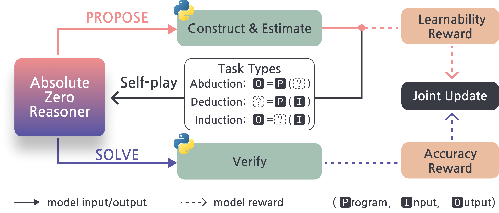

<div align="center">

# Absolute Zero:  Reinforced Self-play Reasoning with Zero Data

[](https://arxiv.org/abs/2505.03335)    [](https://andrewzh112.github.io/absolute-zero-reasoner/)    [](https://github.com/LeapLabTHU/Absolute-Zero-Reasoner)    [](https://huggingface.co/collections/andrewzh/absolute-zero-reasoner-68139b2bca82afb00bc69e5b)    [](https://wandb.ai/andrewzhao112/AbsoluteZeroReasoner)

<div align="center" style="font-family: Arial, sans-serif;">
  <p>
    <a href="#news" style="text-decoration: none; font-weight: bold;">🎉 News</a> •
    <a href="#links" style="text-decoration: none; font-weight: bold;">🔗 Links</a> •
    <a href="#todo" style="text-decoration: none; font-weight: bold;">📝 Roadmap</a> •
    <a href="#algorithm-flow" style="text-decoration: none; font-weight: bold;">⚙️ Algorithm Flow</a> •
    <a href="#results" style="text-decoration: none; font-weight: bold;">📊 Results</a>
  </p>
  <p>
    <a href="#getting-started" style="text-decoration: none; font-weight: bold;">✨ Getting Started</a> •
    <a href="#training" style="text-decoration: none; font-weight: bold;">🏋️ Training</a> •
    <a href="#usage" style="text-decoration: none; font-weight: bold;">🔧 Usage</a> •
    <a href="#evaluation-code" style="text-decoration: none; font-weight: bold;">📃 Evaluation</a>
  </p>
  <p>
    <a href="#citation" style="text-decoration: none; font-weight: bold;">🎈 Citation</a> •
    <a href="#acknowledgement" style="text-decoration: none; font-weight: bold;">🌻 Acknowledgement</a> •
    <a href="#contact" style="text-decoration: none; font-weight: bold;">📧 Contact</a> •
    <a href="#star-history" style="text-decoration: none; font-weight: bold;">📈 Star History</a>
  </p>
</div>

</div>


<!-- ============================================== -->

> **⚠️WARNING⚠️**: New Qwen3 base models have untrained <think> token embeddings, we used `python absolute_zero_reasoner/utils/remove_think_qwen3_tokenizer.py --model_name <Qwen3ModelName>` to remove these tokens or else the model produces nonsense.

> **🚧UNDER TESTING🚧** This new merge to `main` is still under testing. Use the `paper` branch to replicate results from original paper. 

- **[2025/06/30]** We now support [Sandbox-Fusion](https://github.com/bytedance/SandboxFusion) as executor, just put `azr.executor=sandboxfusion` in training configs. Officially completed our initial roadmap.
- **[2025/06/28]** We now support new version of veRL, use the `paper` branch to reproduce the paper results with static copy of veRL. The `main` branch will now be regularly updated with the latest veRL versions.
- **[2025/06/01]** We release code for evals
- **[2025/05/06]** We present the **Absolute Zero Reasoner** [[Project Page](https://andrewzh112.github.io/absolute-zero-reasoner/) | [Paper](https://arxiv.org/abs/2505.03335) | [Code](https://github.com/LeapLabTHU/Absolute-Zero-Reasoner) | [Model(s)](https://huggingface.co/collections/andrewzh/absolute-zero-reasoner-68139b2bca82afb00bc69e5b) | [Logs](https://wandb.ai/andrewzhao112/AbsoluteZeroReasoner)].


<!-- ============================================== -->
<div align="left">
  <h1 id="links">🔗 Links</h1>
  <hr style="height: 3px; background: linear-gradient(90deg, #EF8E8D, #5755A3); border: none; border-radius: 3px;">
</div>

- 🏠 [[Project Page]](https://andrewzh112.github.io/absolute-zero-reasoner/)
- 📜 [[Paper]](https://arxiv.org/abs/2505.03335)
- 🤗 [[Models]](https://huggingface.co/collections/andrewzh/absolute-zero-reasoner-68139b2bca82afb00bc69e5b)
- 💻 [[Code]](https://github.com/LeapLabTHU/Absolute-Zero-Reasoner)
- 📁 [[Logs]](https://wandb.ai/andrewzhao112/AbsoluteZeroReasoner)

<!-- ============================================== -->
<div align="left">
  <h1 id="todo">📝 Roadmap</h1>
  <hr style="height: 3px; background: linear-gradient(90deg, #EF8E8D, #5755A3); border: none; border-radius: 3px;">
</div>

<div style="margin-bottom: 0.8rem; padding: 0.8rem 1.2rem; background-color: rgba(87, 85, 163, 0.1); border-left: 5px solid #5755A3; border-radius: 8px; display: flex; align-items: center;">
  <span style="font-size: 1.2em; margin-right: 0.8rem; color: #5755A3;">✅</span>
  <span style="text-decoration: line-through; color: #AAA; font-size: 1.1em;">Release training code</span>
</div>

<div style="margin-bottom: 0.8rem; padding: 0.8rem 1.2rem; background-color: rgba(87, 85, 163, 0.1); border-left: 5px solid #5755A3; border-radius: 8px; display: flex; align-items: center;">
  <span style="font-size: 1.2em; margin-right: 0.8rem; color: #5755A3;">✅</span>
  <span style="text-decoration: line-through; color: #AAA; font-size: 1.1em;">Release evaluation code</span>
</div>

<div style="margin-bottom: 0.8rem; padding: 0.8rem 1.2rem; background-color: rgba(87, 85, 163, 0.1); border-left: 5px solid #5755A3; border-radius: 8px; display: flex; align-items: center;">
  <span style="font-size: 1.2em; margin-right: 0.8rem; color: #5755A3;">✅</span>
  <span style="text-decoration: line-through; color: #AAA; font-size: 1.1em;">Update veRL</span>
</div>

<div style="margin-bottom: 0.8rem; padding: 0.8rem 1.2rem; background-color: rgba(87, 85, 163, 0.1); border-left: 5px solid #5755A3; border-radius: 8px; display: flex; align-items: center;">
  <span style="font-size: 1.2em; margin-right: 0.8rem; color: #5755A3;">✅</span>
  <span style="text-decoration: line-through; color: #AAA; font-size: 1.1em;">Upgrade Python executor</span>
</div>

<!-- ============================================== -->
<div align="left">
  <h1 id="algorithm-flow">⚙️ Algorithm Flow</h1>
  <hr style="height: 3px; background: linear-gradient(90deg, #EF8E8D, #5755A3); border: none; border-radius: 3px;">
</div>

Our approach centers on a repeated iterative process of the following two steps:

1. <span style="color:#EF8E8D"><b>PROPOSE</b></span>: The model generates reasoning tasks from abduction, deduction, and induction types. Tasks are validated with Python execution and assigned a learnability reward.

2. <span style="color:#5755A3"><b>SOLVE</b></span>: The model then attempts to solve these self-generated tasks. Solutions are verified through Python execution, receiving an accuracy reward.

The model continuously improves through both phases using TRR++, creating a self-evolving loop that strengthens reasoning without external training data.



<!-- ============================================== -->
<div align="left">
  <h1 id="results">📊 Results</h1>
  <hr style="height: 3px; background: linear-gradient(90deg, #EF8E8D, #5755A3); border: none; border-radius: 3px;">
</div>

## Main Results

Our approach achieves strong performance across both code and math reasoning benchmarks without using any external data:

<table>
  <thead>
    <tr>
      <th align="center">Model</th>
      <th align="center">Base</th>
      <th align="center">#data</th>
      <th align="center">Code Avg</th>
      <th align="center">Math Avg</th>
      <th align="center">Total Avg</th>
    </tr>
  </thead>
  <tbody>
    <!-- Base Models Section -->
    <tr>
      <td colspan="6" align="center"><b>Base Models</b></td>
    </tr>
    <tr>
      <td>Qwen2.5-7B</td>
      <td>-</td>
      <td>-</td>
      <td>52.0</td>
      <td>27.5</td>
      <td>39.8</td>
    </tr>
    <tr>
      <td>Qwen2.5-7B-Ins</td>
      <td>-</td>
      <td>-</td>
      <td>56.3</td>
      <td>37.0</td>
      <td>46.7</td>
    </tr>
    <tr>
      <td>Qwen2.5-7B-Coder</td>
      <td>-</td>
      <td>-</td>
      <td>56.6</td>
      <td>23.9</td>
      <td>40.2</td>
    </tr>
    <!-- Zero-Style Reasoners with Code Data -->
    <tr>
      <td colspan="6" align="center"><b>Reasoners Trained on Curated Code Data</b></td>
    </tr>
    <tr>
      <td>AceCoder-RM</td>
      <td>Ins</td>
      <td>22k</td>
      <td>58.3</td>
      <td>37.4</td>
      <td>47.9</td>
    </tr>
    <tr>
      <td>AceCoder-RM</td>
      <td>Coder</td>
      <td>22k</td>
      <td>57.3</td>
      <td>27.5</td>
      <td>42.4</td>
    </tr>
    <tr>
      <td>AceCoder-Rule</td>
      <td>Ins</td>
      <td>22k</td>
      <td>55.4</td>
      <td>36.9</td>
      <td>46.2</td>
    </tr>
    <tr>
      <td>AceCoder-Rule</td>
      <td>Coder</td>
      <td>22k</td>
      <td>60.0</td>
      <td>28.5</td>
      <td>44.3</td>
    </tr>
    <tr>
      <td>CodeR1-LC2k</td>
      <td>Ins</td>
      <td>2k</td>
      <td>60.5</td>
      <td>35.6</td>
      <td>48.0</td>
    </tr>
    <tr>
      <td>CodeR1-12k</td>
      <td>Ins</td>
      <td>10k</td>
      <td>61.3</td>
      <td>33.5</td>
      <td>47.4</td>
    </tr>
    <!-- Zero-Style Reasoners with Math Data -->
    <tr>
      <td colspan="6" align="center"><b>Reasoners Trained on Curated Math Data</b></td>
    </tr>
    <tr>
      <td>PRIME-Zero</td>
      <td>Coder</td>
      <td>484k</td>
      <td>37.2</td>
      <td><b>45.8</b></td>
      <td>41.5</td>
    </tr>
    <tr>
      <td>SimpleRL-Zoo</td>
      <td>Base</td>
      <td>8.5k</td>
      <td>54.0</td>
      <td>38.5</td>
      <td>46.3</td>
    </tr>
    <tr>
      <td>Oat-Zero</td>
      <td>Math</td>
      <td>8.5k</td>
      <td>45.4</td>
      <td>44.3</td>
      <td>44.9</td>
    </tr>
    <tr>
      <td>ORZ</td>
      <td>Base</td>
      <td>57k</td>
      <td>55.6</td>
      <td>41.6</td>
      <td>48.6</td>
    </tr>
    <!-- Our Approach -->
    <tr style="background-color: rgba(239, 142, 141, 0.1);">
      <td colspan="6" align="center"><b>Absolute Zero Training w/ No Curated Data (Ours)</b></td>
    </tr>
    <tr style="background-color: rgba(239, 142, 141, 0.1);">
      <td>AZR (Ours)</td>
      <td>Base</td>
      <td><b>0</b></td>
      <td>55.2 <span style="color:#00AA00">+3.2</span></td>
      <td>38.4 <span style="color:#00AA00">+10.9</span></td>
      <td>46.8 <span style="color:#00AA00">+7.0</span></td>
    </tr>
    <tr style="background-color: rgba(87, 85, 163, 0.1);">
      <td>AZR (Ours)</td>
      <td>Coder</td>
      <td><b>0</b></td>
      <td><b>61.6</b> <span style="color:#00AA00">+5.0</span></td>
      <td>39.1 <span style="color:#00AA00">+15.2</span></td>
      <td><b>50.4</b> <span style="color:#00AA00">+10.2</span></td>
    </tr>
  </tbody>
</table>

## Scaling Results

AZR shows consistent improvements across model sizes and types:

<table>
  <thead>
    <tr>
      <th align="center">Model Family</th>
      <th align="center">Variant</th>
      <th align="center">Code Avg</th>
      <th align="center">Math Avg</th>
      <th align="center">Total Avg</th>
    </tr>
  </thead>
  <tbody>
    <tr>
      <td>Llama3.1-8b</td>
      <td></td>
      <td>28.5</td>
      <td>3.4</td>
      <td>16.0</td>
    </tr>
    <tr style="background-color: rgba(87, 85, 163, 0.1);">
      <td>Llama3.1-8b</td>
      <td>+ AZR (Ours)</td>
      <td>31.6 <span style="color:#00AA00">+3.1</span></td>
      <td>6.8 <span style="color:#00AA00">+3.4</span></td>
      <td>19.2 <span style="color:#00AA00">+3.2</span></td>
    </tr>
    <tr>
      <td>Qwen2.5-3B Coder</td>
      <td></td>
      <td>51.2</td>
      <td>18.8</td>
      <td>35.0</td>
    </tr>
    <tr style="background-color: rgba(87, 85, 163, 0.1);">
      <td>Qwen2.5-3B Coder</td>
      <td>+ AZR (Ours)</td>
      <td>54.9 <span style="color:#00AA00">+3.7</span></td>
      <td>26.5 <span style="color:#00AA00">+7.7</span></td>
      <td>40.7 <span style="color:#00AA00">+5.7</span></td>
    </tr>
    <tr>
      <td>Qwen2.5-7B Coder</td>
      <td></td>
      <td>56.6</td>
      <td>23.9</td>
      <td>40.2</td>
    </tr>
    <tr style="background-color: rgba(87, 85, 163, 0.1);">
      <td>Qwen2.5-7B Coder</td>
      <td>+ AZR (Ours)</td>
      <td>61.6 <span style="color:#00AA00">+5.0</span></td>
      <td>39.1 <span style="color:#00AA00">+15.2</span></td>
      <td>50.4 <span style="color:#00AA00">+10.2</span></td>
    </tr>
    <tr>
      <td>Qwen2.5-14B Coder</td>
      <td></td>
      <td>60.0</td>
      <td>20.2</td>
      <td>40.1</td>
    </tr>
    <tr style="background-color: rgba(87, 85, 163, 0.1);">
      <td>Qwen2.5-14B Coder</td>
      <td>+ AZR (Ours)</td>
      <td>63.6 <span style="color:#00AA00">+3.6</span></td>
      <td>43.0 <span style="color:#00AA00">+22.8</span></td>
      <td>53.3 <span style="color:#00AA00">+13.2</span></td>
    </tr>
  </tbody>
</table>

<!-- ============================================== -->
<div align="left">
  <h1 id="getting-started">✨ Getting Started</h1>
  <hr style="height: 3px; background: linear-gradient(90deg, #EF8E8D, #5755A3); border: none; border-radius: 3px;">
</div>

## 🎄 Environment Setup
```bash
conda env create -f azr_env.yml
conda activate azr
pip install -r flashattn_requirements.txt
python scripts/prepare_test_datasets.py 
```

## 💾 Data Processing
### Process evaluation data on CruxEval / LiveCodeBench Execution during AZR Self-play
```bash
python -m absolute_zero_reasoner.data_construction.process_code_reasoning_data
```

<!-- ============================================== -->
<div align="left">
  <h1 id="training">🏋️ Training</h1>
  <hr style="height: 3px; background: linear-gradient(90deg, #EF8E8D, #5755A3); border: none; border-radius: 3px;">
</div>

> **⚠️WARNING⚠️**: The Python executor in this repository is very raw and intended for research purposes only. It is not secure for production environments. We plan to update our executor to more secure implementations in the future. Your use of our code is at your own discretion and risk.


## 🫛 Seeding (Optional)
We provide the seed datasets we collected by prompting each model in data/. If you want to create your own seed data, use the following script:
```bash
export OUTPUT_SEED_PATH=data/<new_ded_abd_seed_data_name>.jsonl
export OUTPUT_CODE_F_SEED_PATH=data/<new_ind_seed_data_name>.jsonl
bash scripts/seeding/<7b|14b|coder3b|coder7b|coder14b|llama>.sh
```

## ♟️ Self-play
3b models need 2 X 80gb GPUs, 7/8b models need 4 X 80gb, 14b requires 8 X 80gb
```bash
bash scripts/selfplay/<7b|14b|coder3b|coder7b|coder14b|llama>.sh
```
If you want to use your own ded/abd or ind seed dataset:
```bash
export OUTPUT_SEED_PATH=data/<your_ded_abd_seed_data_name>.jsonl
export OUTPUT_CODE_F_SEED_PATH=data/<your_ind_seed_data_name>.jsonl
bash scripts/selfplay/<7b|14b|coder3b|coder7b|coder14b|llama>.sh
```
For using the newly supported sandbox-fusion executor, use docker and set `azr.executor=sandboxfusion`.

## 🌚 Resuming Runs
When resuming runs, put the original run wandb id into the script, i.e., `trainer.wandb_run_id=<run_id>`.

## 🤗 Converting veRL checkpoints to HF format
```bash
python -m absolute_zero_reasoner.utils.convert2hf \
  <veRL_ckpt_path>/actor \
  <veRL_ckpt_path>/actor/huggingface/ \
  <hf_ckpt_path>
```

## 📈Design Your Own Intrinsic Rewards!
In configs, just add your own rewards to `azr.reward.generation_reward_config`, check the ones already implemented such as diversity and complexity rewards. Be Creative!

<!-- ============================================== -->
<div align="left">
  <h1 id="usage">🔧 Usage</h1>
  <hr style="height: 3px; background: linear-gradient(90deg, #EF8E8D, #5755A3); border: none; border-radius: 3px;">
</div>

We use the Deepseek R1 <think> & <answer> tags as prompt template:

```
A conversation between User and Assistant. The user asks a question, and the Assistant solves it. The assistant first thinks about the reasoning process in the mind and then provides the user with the answer. The reasoning process and answer are enclosed within <think> </think> and <answer> </answer> tags, respectively, i.e., <think> reasoning process here </think> <answer> answer here </answer>. User: {question}\nAssistant: <think>
```

<!-- ============================================== -->
<div align="left">
  <h1 id="evaluation-code">📃 Evaluation Code</h1>
  <hr style="height: 3px; background: linear-gradient(90deg, #EF8E8D, #5755A3); border: none; border-radius: 3px;">
</div>

## LiveCodeBench
Setup: LCB needs to first download the data
```bash
git clone https://hf-mirror.com/datasets/livecodebench/code_generation_lite evaluation/code_eval/coding/LiveCodeBench/code_generation_lite
```
Evaluation:
```bash
bash evaluation/code_eval/scripts/run_lcb_gen.sh --model <andrewzh/Absolute_Zero_Reasoner-Coder-3b>
```

## Evalplus
New conda env is neede for evalplus
```bash
conda create -n evalplus python=3.11
pip install --upgrade "evalplus[vllm] @ git+https://github.com/evalplus/evalplus@d362e933265c3e7e3df8101c930a89c3c470cd9f"
Evaluation:
```bash
condda activate evalplus
bash evaluation/code_eval/scripts/run_evalplus.sh 0 <humaneval|mbpp> <andrewzh/Absolute_Zero_Reasoner-Coder-3b>
```

## Math
Please refer to [evaluation/math_eval/README.md](evaluation/math_eval/README.md) for math evaluation.


<!-- ============================================== -->
<div align="left">
  <h1 id="citation">🎈 Citation</h1>
  <hr style="height: 3px; background: linear-gradient(90deg, #EF8E8D, #5755A3); border: none; border-radius: 3px;">
</div>

If you find Absolute Zero Reasoner helpful, please cite us.

```bibtex
@misc{zhao2025absolutezeroreinforcedselfplay,
      title={Absolute Zero: Reinforced Self-play Reasoning with Zero Data}, 
      author={Andrew Zhao and Yiran Wu and Yang Yue and Tong Wu and Quentin Xu and Yang Yue and Matthieu Lin and Shenzhi Wang and Qingyun Wu and Zilong Zheng and Gao Huang},
      year={2025},
      eprint={2505.03335},
      archivePrefix={arXiv},
      primaryClass={cs.LG},
      url={https://arxiv.org/abs/2505.03335}, 
}
```

<!-- ============================================== -->
<div align="left">
  <h1 id="acknowledgement">🌻 Acknowledgement</h1>
  <hr style="height: 3px; background: linear-gradient(90deg, #EF8E8D, #5755A3); border: none; border-radius: 3px;">
</div>

Our reinforcement learning training codebase is a fork of the [veRL framework](https://github.com/volcengine/verl). For rollouts, we used [vLLM](https://github.com/vllm-project/vllm). The Python executor components are adapted from the [QwQ Repository](https://github.com/QwenLM/QwQ/tree/main/eval/eval/math_opensource_utils). Additionally, we borrowed our README structure from [PRIME](https://github.com/PRIME-RL/PRIME).
Many thanks to the authors of these projects for their excellent contributions!

<!-- ============================================== -->
<div align="left">
  <h1 id="contact">📧 Contact</h1>
  <hr style="height: 3px; background: linear-gradient(90deg, #EF8E8D, #5755A3); border: none; border-radius: 3px;">
</div>

Feel free to contact Andrew Zhao via email: zqc21@mails.tsinghua.edu.cn

<!-- ============================================== -->
<div align="left">
  <h1 id="star-history">📈 Star History</h1>
  <hr style="height: 3px; background: linear-gradient(90deg, #EF8E8D, #5755A3); border: none; border-radius: 3px;">
</div>

[](https://www.star-history.com/#LeapLabTHU/Absolute-Zero-Reasoner&Date)